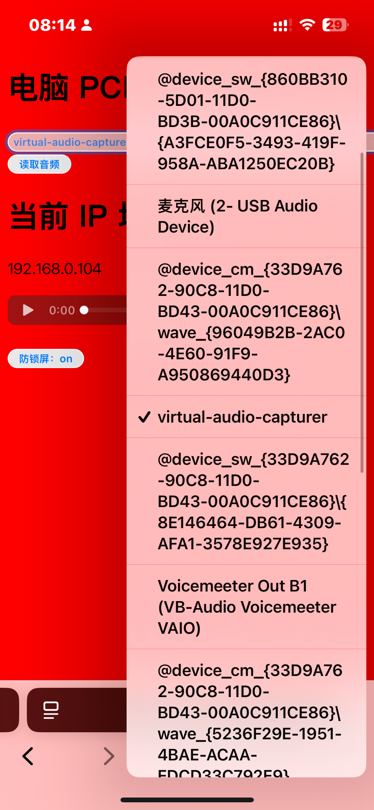
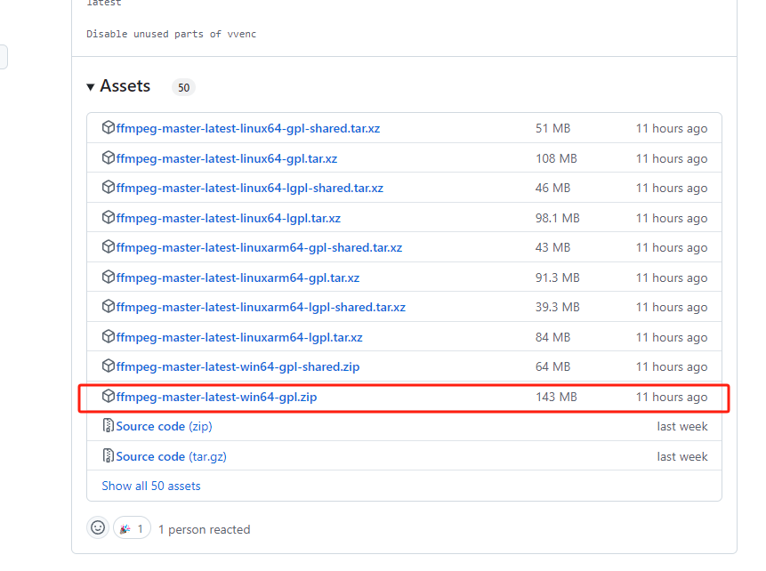
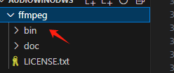
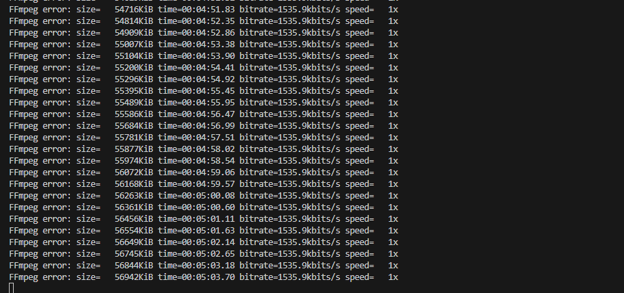

##  windows电脑本地音频导流到局域网


打开手机点个外卖，找个电影，发现台式机没有外放。。。。 所以开发了这款程序，可以利用手机播放电脑声音。


打开原理 使用 FFmpeg 解码出来的音频数据 PCM 格式，使用H5的 Web Audio Api 来播放

听起来简单，实现起来发现没办法获取window播放设备，只能读取到输入设备~

尝试多种方案，发现可以使用 directshow 源捕获设备 实现虚拟设备


## 环境

nodejs

ffmpeg （已提供）

​device设备采集音视频数据（已提供）

- 运行 Setup.Screen.Capturer.Recorder.v0.13.3.exe 即可安装device

安装后自动虚拟出 screen-capture-recorder 和 virtual-audio-capturer 设备 可通过 ```ffmpeg -list_devices true -f dshow -i dummy``` 指令查看

screen-capture-recorder 获取的是电脑视频流

virtual-audio-capturer 获取的是播放扬声器音频流



## 使用教程


### 1.下载ffmpeg 解压到根目录重命名为 ffmpeg

[FFmpeg 下载](https://github.com/BtbN/FFmpeg-Builds/releases)





### 2.安装 device

运行 Setup.Screen.Capturer.Recorder.v0.13.3.exe  自动安装虚拟设备

[Setup.Screen.Capturer.Recorder.v0.13.3.exe 下载](https://github.com/rdp/screen-capture-recorder-to-video-windows-free/releases)


### 3.启动服务

```shell

cnpm i

npm run dev

```

### 4.手机访问 ip:3000


ws 实时传送音频流




## 补充

```shell

cd ffmpeg/bin

# 录制视频
ffmpeg -f dshow -i video="screen-capture-recorder" output.flv

# 录制音频
ffmpeg -f dshow -i audio="virtual-audio-capturer" output.wav


ffmpeg -i output.wav


# 查看设备列表

ffmpeg -list_devices true -f dshow -i dummy


```

```Windows PowerShell

Test-NetConnection -ComputerName 192.168.0.104 -Port 3000

```


## 鸣谢

[WasmVideoPlayer](https://github.com/sonysuqin/WasmVideoPlayer)

[Desktop中文版本](https://trac.ffmpeg.org/wiki/Capture/Capture/Desktop%E4%B8%AD%E6%96%87%E7%89%88%E6%9C%AC)

[​device - 屏幕捕获录像机到视频 windows](https://github.com/rdp/screen-capture-recorder-to-video-windows-free?tab=readme-ov-file) 

[网络音频 API 支持浏览器可视图](https://caniuse.com/?search=web%20audio)
